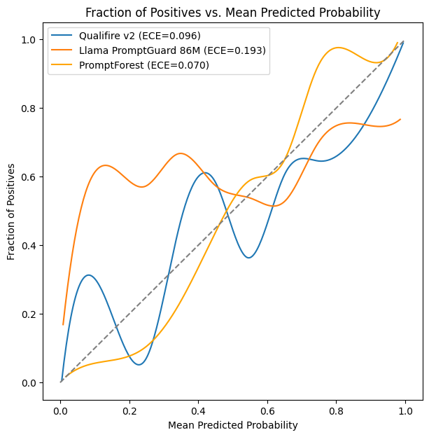

# PromptForest: Fast, Calibrated & Reliable Injection Detection

[](https://pypi.org/project/promptforest/)
[](LICENSE)
[](https://colab.research.google.com/drive/1EW49Qx1ZlaAYchqplDIVk2FJVzCqOs6B?usp=sharing)

**PromptForest** is an ensemble-based prompt injection detection system designed for high-throughput production environments. By aggregating predictions from multiple lightweight expert models, it achieves best-in-class calibration and competitive accuracy while maintaining significantly lower latency than comparable monolithic models.

---

## 1. Introduction

Large Language Models (LLMs) are vulnerable to prompt injection attacks where adversarial inputs manipulate the model into executing unintended commands. Traditional defenses often rely on single, large BERT-based classifiers which suffer from two key limitations:
1.  **High Latency:** Large transformer models introduce significant overhead in critical paths.
2.  **Overconfidence:** Single models tend to be overconfident in their predictions, even when incorrect (high Expected Calibration Error).

PromptForest addresses these issues through **Ensemble Diversity**. We combine the signals from diverse architectures (DeBERTa, XGBoost, etc.) to produce a discrepancy-weighted risk score. This allows for:
-   **Robustness:** Disagreement between models flags ambiguous inputs.
-   **Efficiency:** The total parameter count is <50% of the leading SOTA monolithic detector.
-   **Calibration:** Lower confidence on incorrect predictions reduces catastrophic failures.

## 2. Methodology

PromptForest utilizes a voting ensemble of three distinct lightweight models:
1.  **Meta Llama Prompt Guard 86M:** Meta's prompt injection detector, already very calibrated for its parameter count (ECE lowest for its parameter class in candidate models).
2.  **Vijil Dome:** Vijil's ModernBERT finetune, has the highest parameter efficiency in all candidate models.
3.  **PromptForest-XGB:** A custom XGBoost model trained on embedding features.

Predictions are aggregated using a weighted voting mechanism to form a sophisticated consensus mechanism that outperforms individual voters in calibration metrics.

## 3. Performance Evaluation

We benchmarked PromptForest against a wide range of detection models, with the SOTA model `Qualifire Sentinel v2` being the best performing competitor model. You can view our benchmarking code in the `benchmark` folder.

### 3.1 Reliability & Calibration

PromptForest demonstrates superior calibration, meaning its reported confidence scores better reflect the true probability of correctness. Lower ECE (Expected Calibration Error) indicates more trustworthy probability outputs.



| Metric | PromptForest (Ensemble) | Qualifire Sentinel v2 (Baseline) | Improvement |
| :--- | :---: | :---: | :---: |
| **Accuracy** | 0.901 | **0.973** | - |
| **ECE (Lower is better)** | **0.070** | 0.096 | **+27%** |
| **Avg Conf. on Failure** | **0.642** | 0.760 | **+16%** |
| **Parameter Count** | **~237M** | ~600M | **60% fewer** |

While Sentinel v2 achieves higher raw accuracy, PromptForest is significantly less confident when it makes mistakes (0.642 vs 0.760), making it safer for "Human-in-the-Loop" fallback systems.

### 3.2 Latency Benchmark

We compared the end-to-end inference time (including tokenization) on a standard Macbook CPU node on 3000 prompts of varying length. Our latency was significantly lower, despite our server overhead, showing that PromptForest is adequately optimised for real-world speed.

| System | Mean Latency (ms) | P95 Latency (ms)
| :--- | :---: | :---: |
| **Qualifire Sentinel v2** | *~225.77ms* | *~430.31ms* |
| **PromptForest** | **~141.07ms** | **~257.19ms** |


## 4. Quick Start

PromptForest is designed for immediate deployment.

```bash
# Install valid package
pip install promptforest

# Start the optimized inference server
promptforest serve --port 8000
```

The server automatically handles model downloading, caching, and ensemble orchestration.

## 5. Downstream Integration

PromptForest outputs the following JSON, where entries like `is_malicious` or `confidence` could be used in downstream tasks.
```json
{
  "is_malicious": true/false,
  "confidence": float,
  "uncertainty": float,
  "malicious_score": float,
  "max_risk_score": float,
  "details": {
    "llama_guard": float,
    "vijil": float,
    "xgboost": float
  },
  "latency_ms": float
}
```
To configure the models or the output, please use a [config.yaml](config.yaml). 

## 6. Models & Attribution

PromptForest ensembles the following open-weights models:

| Provider | Model | License |
| :--- | :--- | :--- |
| **Meta** | [Llama Prompt Guard 86M](https://huggingface.co/meta-llama/Prompt-Guard-86M) | Llama Community |
| **Vijil** | [Vijil Dome](https://huggingface.co/vijil/vijil_dome_prompt_injection_detection) | Apache 2.0 |
| **Appleroll** | [PromptForest-XGB](https://huggingface.co/appleroll/promptforest-xgb) | Apache 2.0 |

## 7. Disclaimer

PromptForest is an evolving research project. It is not a standalone security solution and should be used as part of a defense-in-depth strategy alongside input sanitization (e.g., NeMo Guardrails) and system prompting.

## License

Apache 2.0. See `LICENSE` and `THIRD_PARTY_LICENSES` for details.
